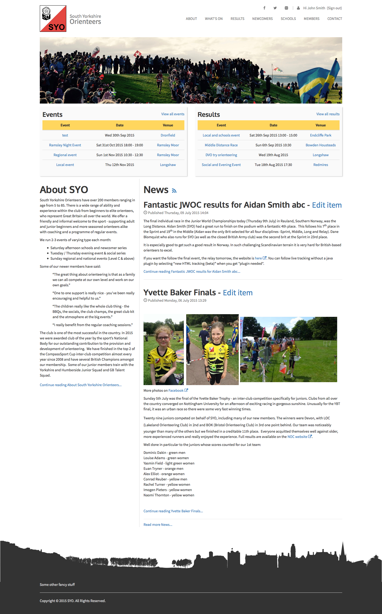
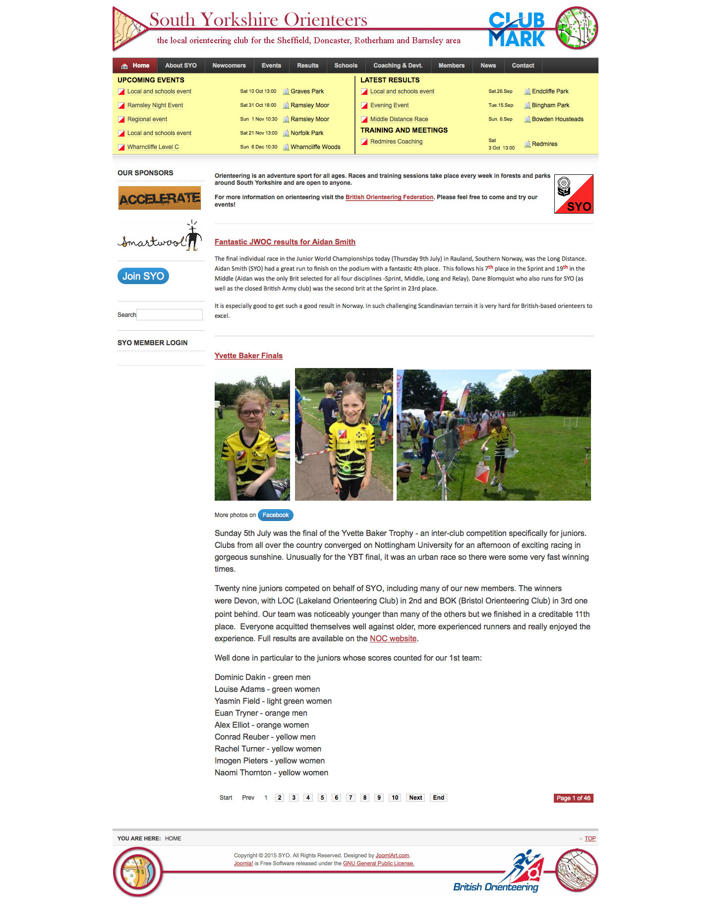

# Orienteering Website

A redesign of a Joomla-based orienteering website that utilises Bootstrap 3 for mobile device support. Also includes improvements in accessibility through use of HTML5 semantic elements and (attempted) following of WCAG 2.0.

The new site design is currently undergoing testing, but will be deployed on completion of testing. A static prototype of the new design can be found at <http://abradbury.github.io/Orienteering-Website-Static/>.

The files included in this repository are primarily those needed to create a Joomla template following the new design. The output of many Joomla components needed to be overriden to follow the new design.

## Outstanding Issues
* Joomla and Bootstrap 3 don't play nicely, so there are conflicts/issues with JavaScript meaning that articles and events sometimes cannot be saved. 
* Additionally, further control needs to be exerted on the articles to restrict how users are able to style documents such that they are inline with the design of the site. 
* Management of images (both site and article) for the different screen sizes is also an issue that needs addressing.

## Future Work
* Extending and customising the Joomla Event Manager (JEM) component such that it is better suited for managing orienteering events.  

## Screenshots
Below is a screenshot of the new orienteering website design. 

Below is a screenshot of the old orienteering website design.

