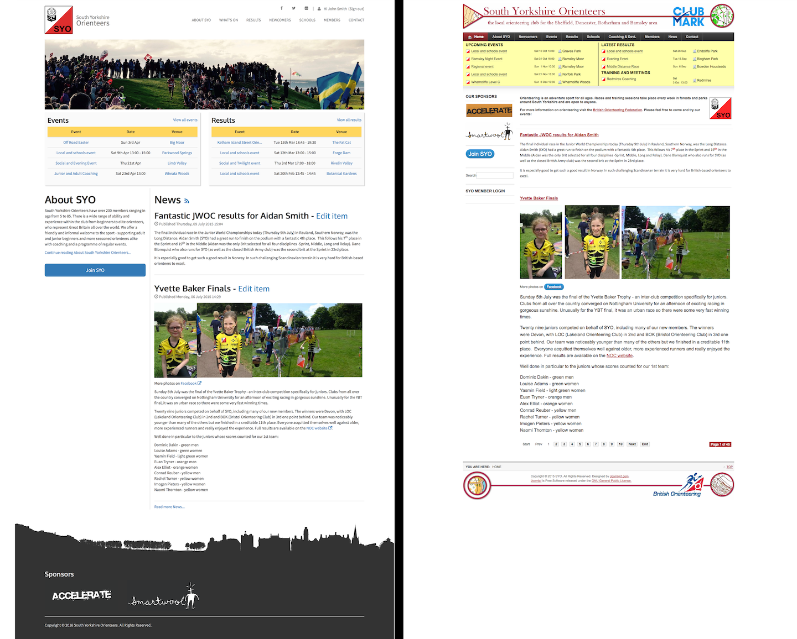

# Orienteering Website

A redesign of a Joomla-based orienteering website that utilises Bootstrap for mobile device support. Also includes improvements in accessibility through use of HTML5 semantic elements and (attempted) following of WCAG 2.0.

The new site design is now in use and can be seen at <http://www.southyorkshireorienteers.org.uk/>.

The files included in this repository are primarily those needed to create a Joomla template following the new design. The output of many Joomla components needed to be overridden to follow the new design.

## Screenshots
The image below shows a side-by-side comparison of the new and old designs for the orienteering website. The old site is shown on the right and the new site on the left. 

